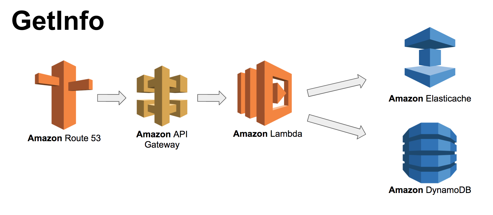
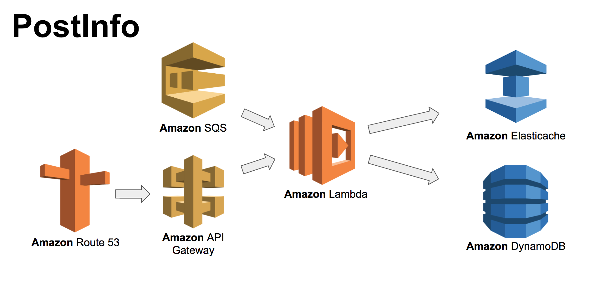

# UrlInfo Service

This service is used to store information about specific urls that are known sources of malware.

The service runs on AWS Lambda using Node.js 6.1. Data is stored in DynamoDB and is fronted by a Redis-backed bloom filter. The purpose of the bloom filter is to serve as a distributed cached and compressed representation of the data in order to reduce latency and minimize load on the central data stores.

The service consists of two entry points:
- getInfo: for checking if a URL is a source of malware
- postInfo: for adding a URL to the malware data store

### getInfo



This function is accessible via the route:

`GET /urlinfo/1/{hostname_and_port}/{original_path_and_query_string}`

The hostname and port are separated using a colon. The following are examples of possible routes:

* `GET /urlinfo/1/example.com:80/page.html?foo=bar`
* `GET /urlinfo/1/example.com:80/page.html`
* `GET /urlinfo/1/malware.com:80`

The service does a recursive check against URLs in its data store. For example, a URL containing a path and query parameters will be tested to match against:

1. the full path including the query string
2. the path including the page, excluding the query string
3. just the fully qualified domain name and port, excluding the path and query string

The purpose of the recursive matching is so that pages (regardless of query string params) and full domains can be flagged as a source of malware.

The route will return:
* _200 OK_ HTTP status code if the client can access the URL (eg. it is a source of malware)
* _403 Forbidden_ HTTP status code if the URL is blocked because it is a known source of malware

### postInfo



This function is accessible via the route:

`POST /urlinfo/1/{hostname_and_port}/{original_path_and_query_string}`

where the body of the post should contain the information associated with the URL encoded as JSON and transmitted with the Content-Type '_application/json_'.

The following fields are currently accepted:

```
{
  "threat": [the type of thread, eg. "virus", "phishing"],
  "discovered_ts": [the timestamp when the threat was first discovered (in ISO datetime format)],
  "scanned_ts": [the date that the threat was last known to exist]
}
```

This HTTP route is primarily for testing. The main way that url information is transmitted to the data store is via an SQS queue where the message body contains the same JSON payload.

## Accessing the service

The deployed service is associated with the apex domain: _malwareinfo.host_. There is an SSL certificate associated with the domain and HTTP traffic is automatically redirected to HTTPS.

Here are a few sample commands using *curl* that can be used to test the service.

```
curl -i https://malwareinfo.host/urlinfo/1/example.com:80/hello.html
```

Returns a 200 status code as the URL is not a known malware source.

```
curl -i https://malwareinfo.host/urlinfo/1/abcd.com:80/mal.html
```

Returns a 403 status code as the URL is a known malware source.

```
curl -X POST https://malwareinfo.host/urlinfo/1/malware99.com:80 -H "Content-Type: application/json" -d '{ "threat": "virus" }'
```

Adds this domain to the malware data store and associated filters.

```
curl -i https://malwareinfo.host/urlinfo/1/malware99.com:80/mal.html
```

Will return a 403 as the domain has been flagged as a source of malware.

## Design

Aside from the service entry points, the service consists of two types of modules:
- stores: client code for accessing the associated url data store.
- filters: as the vast majority of web sites are not sources of malware, filters reduce traffic to the data store as they can quickly filter out traffic to URLs that are unlikely to contain malware.

Each type of module implements a common interface. This allows the implementation to be swapped out for testing and newly added modules can be swapped in. The modules are also designed to be chained together through composition so that multiple filters and stores can be plugged together.

## Setup (for macOS)

1. Install Node.js (8.x is recommended) using Homebrew or similar: `brew install node`
1. Install the yarn package manager for Node.js (recommended): `brew install yarn`
1. Install git (if not already installed): `brew install git`
1. Clone the git repo: `git clone git@github.com:exortech/urlinfo.git`
1. Install dependencies: `yarn install`

## Coding

Javascript is written in accordance with the [standardJS](https://standardjs.com/) coding style. Conformance can be verified by running `yarn standard`.

Tests are written using [ava](https://github.com/avajs/ava). The project uses both unit and integration tests, where the integration tests run against external dependencies.

The unit tests can be run without requiring any additional setup via `yarn test:unit`.

Running the integration tests requires:
1. installing and running a local [Redis](https://redis.io/) instance (`brew install redis`)
2. running and initializing a local Dynalite instance using `yarn start-dynalite`. This will run a [script](https://github.com/exortech/urlinfo/blob/master/test-integration/startDynalite.js) that creates the associated tables and populates it with some sample data.

## Deployment

Deploying new versions of the service is done using the [Serverless framework](https://serverless.com). It packages the code and builds the necessary CloudFormation templates to automatically install the service and provision the necessary depend services.

- deployment to the default (dev) stage can be done using `yarn deploy`. This will deploy to the default AWS region (*us-east-1* unless overridden)
- production deployment (`yarn deploy:prd`) deploys to the *us-east-2* region using the *prd* stage.

Deploying requires having an AWS account with access preconfigured through AWS credentials.

As the Lambda functions need to access Elasticache, this means that the Lambda and Elasticache cluster need to run in the same VPC and subnets. Currently, the system is configured to use a hardcoded VPC and set of subnets. This would need to be extended to support deploying into other environments.

## TODO

- better handling of query string parameters. Query string parameters are order-independent (commutative). So doing an exact match against query string parameters will break if the parameters are reordered.
- transition from Lambda to managed container using ECS running a local Redis. This will reduce overall request latency.
- consider using a Bloom filter Redis module (like [Rebloom](https://redislabs.com/blog/rebloom-bloom-filter-datatype-redis/))
- include provisioning of Elasticache, VPC and DynamoDb endpoints in _serverless.yml_.
- investigate if [DAX](http://www.allthingsdistributed.com/2017/06/amazon-dynamodb-accelerator-dax.html) will eliminate the need for the filter.
- switch from Bloom filter to Cuckoo filter for redisUrlFilter for speed and to support removing URLs from filter.
- run load tests. The currently provisioned infrastructure is inadequate to be indicative of how the system will respond as load ramps of. Would need to provision more production-ready infrastructure to sustain more significant load.
- deploy to other regions. Currently this service is only accessible in a single region, but to scale this out, it should be available in as many regions as possible to bring the service close to the consumer.
- set up an automated build service like TravisCI.
